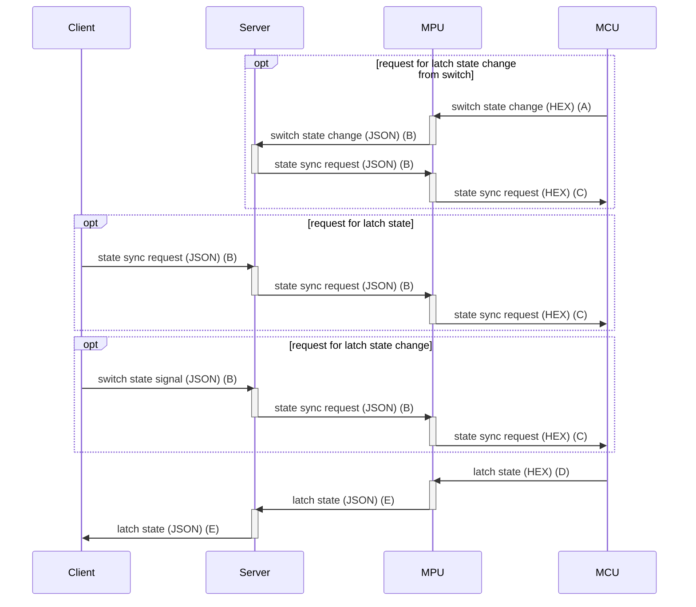

# mt7688-control-unit

This is a home automation project with three controller (A, B, and C) to controll 64 relay channels and receive 80 on/off switches.
 


## Control Unit Details

### Relay Control

74HC595 and ULN2803 are used to control 24V relay system.  All 74HC595 chips are linked and controlled by 3 digit pins on MT7688.  Each ULN2803 has an LED array as an indicator of relay status.

### Switches

CD4021 is used to detect the swtich status change.  The swtich can be any on/off switch.  All CD4021 chips are linked and send signals to 3 digit pins on MT7688.

### Pictures

#### Unit A


[Larger Picture Download](https://yuhuachang.github.io/repo/mt7688-control-unit/controller-A.jpg)

#### Unit B


[Larger Picture Download](https://yuhuachang.github.io/repo/mt7688-control-unit/controller-B.jpg)

#### Unit C


[Larger Picture Download](https://yuhuachang.github.io/repo/mt7688-control-unit/controller-C.jpg)

## Server Communication

Central server receive signals from swtiches and translates to latch control signal, sending to all control units by REST calls.  Central server also receives latch status from all control units and publish to all clients by websocket.  Client subscribe the latch status and maintain the websocket connection.

## Swtich Latch Control



### A. switch change (MCU to MPU)
#### switch state
- BIN: `0100 0011 0010 0000 0100 1000 0000 0000 0010 0000 0100 1000 0000 0001`
    - the 1st bit: 0 -> latch state (false)
    - the 2nd bit: 1 -> swtich state (true)
    - the 3rd bit: 0 -> reserved (false)
    - the 4th bit: 0 -> reserved (false)
    - 5th to 8th bits: 11 (3) -> data byte count is 3 (3 bytes)
    - the following 3 bytes: 3 bytes of old value.
    - the following 3 bytes: 3 bytes of new value.
- HEX: `0x43 0x20 0x48 0x00 0x20 0x48 0x01`

Header is one byte. Body includes 3 bytes of old value and 3 bytes of
new value, totally 6 bytes.  In this way, MPU does not need to save
the old and new value; All values are from MCU.

MPU can use XOR on old value and new value to find the differences.

### B. state change and state sync request (to Server and MPU)

#### state sync request
```jsonld=
{
  "header": {
    "state sync": true
  }
}
```

#### state change with sync request
```jsonld=
{
  "header": {
    "state change": true,
    "state sync": true
  },
  "switch": {
    "C02": true,
    "C12": true,
    "C22": false
  }
}
```

In header, we set two types of requests: "state change" and "state sync".
In "switch" section, it's a key-value pair for each switch state.
Each switch has a global unique name and a boolean value.

### C. state change and state sync request (to MCU)
#### state sync request only
- Only one byte for header.
- BIN: `1000 0000`
    - the 1st bit: 1 -> request for latch state (true)
    - the 2nd bit: 0 -> request for swtich state (false)
    - the 3rd bit: 0 -> wirte to latch state (false)
    - the 4th bit: 0 -> reserved (false)
    - 5th to 8th bits: 0 -> data byte count (no body)
- HEX: `0x80`
#### state change with state sync request
- The first byte for header followed by 3 bytes body.
- BIN: `1010 0011 ...`
    - the 1st bit: 1 -> request for latch state (true)
    - the 2nd bit: 0 -> request for swtich state (false)
    - the 3rd bit: 1 -> wirte to latch state (true)
    - the 4th bit: 0 -> reserved (false)
    - 5th to 8th bits: 0011 -> data byte count (3)
    - the following 3 bytes of mask; 1 = on, 0 = off.
    - the following 3 bytes of data.
- HEX: `0xA3 0x01 0xE0 0xA3 ...`

If data byte count is 3, the total message bytes is
1 (header) + 3 (mask) + 3 (data) = 7 bytes.

MCU uses mask to tell which bit in data effects, then read the target bit from data section.

### D. latch state (to MPU)
#### latch state
- BIN: `1000 0011 0010 0000 0100 1000 0000 0001`
    - the 1st bit: 1 -> latch state (true)
    - the 2nd bit: 0 -> swtich state (false)
    - the 3rd bit: 0 -> reserved (false)
    - the 4th bit: 0 -> reserved (false)
    - 5th to 8th bits: 11 (3) -> data byte count is 3 (3 bytes)
    - the rest: 3 bytes of body.
- HEX: `0x83 0x20 0x48 0x01`

### E. latch state (to Server and Client)
Example from "C" unit.
```jsonld=
{
  "latch": {
    "C0": false,
    "C1": false,
    "C2": true,
    "C3": false,
    "C4": false,
    "C5": false,
    "C6": false,
    "C7": false,
    "C8": false,
    "C9": true,
    "C10": false,
    "C11": false,
    "C12": true,
    "C13": false,
    "C14": false,
    "C15": false,
    "C16": false,
    "C17": false,
    "C18": false,
    "C19": false,
    "C20": false,
    "C21": false,
    "C22": false,
    "C23": true
  }
}
```

Each latch has a global unique key with a boolean value.

Mixed state of unit "A", "B", and "C".
```jsonld=
{
  "latch": {
    "A0": false,
    "A1": false,
    "A2": true,
    "A3": false,
    "A4": false,
    ...
    "A22": false,
    "A31": false,
    "B0": false,
    "B1": false,
    "B2": false,
    ...
    "B6": false,
    "B7": false,
    "C0": false,
    "C1": false,
    "C2": true,
    "C3": false,
    "C4": false,
    ...
    "C22": false,
    "C23": true
  }
}
```

Latch states from each control unit can merged into one state package published to all clients.


